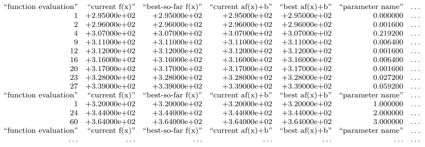

# IOHanalyzer

The __performance analyzer__ for <b>I</b>terative <b>O</b>ptimization <b>H</b>euristics (IOHs).

* __Documentation__: [https://arxiv.org/abs/1810.05281](https://arxiv.org/abs/1810.05281)
* __Wiki page__: [https://iohprofiler.github.io/IOHanalyzer](https://iohprofiler.github.io/IOHanalyzer)
* __Bug reports__: [https://github.com/IOHprofiler/IOHAnalyzer/issues](https://github.com/IOHprofiler/IOHAnalyzer/issues)
* __Online service__: [http://iohprofiler.liacs.nl](http://iohprofiler.liacs.nl)
* __General Contact__: [iohprofiler@liacs.leidenuniv.nl](iohprofiler@liacs.leidenuniv.nl)
* __Mailing List__: [https://lists.leidenuniv.nl/mailman/listinfo/iohprofiler](https://lists.leidenuniv.nl/mailman/listinfo/iohprofiler)

It <i>provides</i>:

* a web-based interface to analyze and visualize the empirical performance of IOHs
* interactive plot
* statistical evaluation
* report generation
* `R` programming interfaces in the backend

It is <i>built on</i>:

* `R` packages [Shiny](https://shiny.rstudio.com/), [Plotly](https://plot.ly/) and [Rcpp](http://www.rcpp.org/).
* [scmacp](https://github.com/b0rxa/scmamp) package for Bayesian analysis.

It is <i>available through</i>:

* a free [online service](#server) that you can use right away.
* [install](#install) the package and [run](#run) it locally

## <a name="server"></a>Online Service

A free server [http://iohprofiler.liacs.nl](http://iohprofiler.liacs.nl) running the stable version of __IOHanalyzer__ is hosted in [Leiden Institute of Advanced Computer Science](https://liacs.leidenuniv.nl/). You're welcome to check it out!

## <a name="install"></a>Installation

### Software dependency

* [mandatory] `R` As __IOHanalyzer__ is written as a `R` package, the `R` environment has to be installed first. The binary file and installation manual for R can be found here [https://cran.r-project.org/](https://cran.r-project.org/).
* [optional] `orca` required to download plotly figures. Please see [https://github.com/plotly/orca](https://github.com/plotly/orca) for the installation instruction.
* [optional] `inkscape` required to support pdf and eps figure format in downloading. Please visit the Inskscape Wiki page [http://wiki.inkscape.org/wiki/index.php/Installing_Inkscape](http://wiki.inkscape.org/wiki/index.php/Installing_Inkscape) for the detail.

### Stable version

Please start up a `R` console and install the stable version as:

```r
install.packages('IOHanalyzer')
```

which is maintained on [CRAN](https://CRAN.R-project.org/package=IOHanalyzer) (Comprehensive R Archive Network).

### Lastest version

The lastest development is always hosted on Github. In case you'd like to try out this version, the `R` package <tt>devtool</tt> is needed:

```r
install.packages('devtools')
devtools::install_github('IOHprofiler/IOHanalyzer')
```

## <a name="run"></a>Runinng the Web Interface locally

The IOHanalyzer package can be installed and loaded using the following commands:

```r
library('IOHanalyzer')
runServer()
```

Have fun! For the complete reference on usage, please check out our Wiki page or documentation.

## Host it online?

We provide docker file for deploying __IOHanalyzer__ on the server. Please see [https://github.com/IOHprofiler/IOHanalyzer-docker](https://github.com/IOHprofiler/IOHanalyzer-docker) for details.

## Supported Data Format

Data preparation is fairly easy for this tool. Just compress the data folder obtained from the experiment into a __zip__ file and uploaded it. Currently, we support two data formats:

* IOHprofiler: our own csv-based format that is adopted from COCO. An example of the raw data file is as follows:

Please see our wiki page for the specification and regulation on the data format.

* COCO: data format of the [COCO benchmark environment](https://github.com/numbbo/coco).

## Our Team

* [Hao Wang](https://www.universiteitleiden.nl/en/staffmembers/hao-wang#tab-1), <i>Leiden Institute of Advanced Computer Science</i>.
* Diederick Vermetten, <i>Leiden Institute of Advanced Computer Science</i>.
* [Carola Doerr](http://www-desir.lip6.fr/~doerr/), <i>CNRS and Sorbonne University</i>.
* [Furong Ye](https://www.universiteitleiden.nl/en/staffmembers/furong-ye#tab-1), <i>Leiden Institute of Advanced Computer Science</i>.
* [Sander van Rijn](https://www.universiteitleiden.nl/en/staffmembers/sander-van-rijn#tab-1), <i>Leiden Institute of Advanced Computer Science</i>.
* [Thomas Bäck](https://www.universiteitleiden.nl/en/staffmembers/thomas-back#tab-1), <i>Leiden Institute of Advanced Computer Science</i>.

When using IOHprofiler and parts thereof, please kindly cite this work as

Carola Doerr, Hao Wang, Furong Ye, Sander van Rijn, Thomas Bäck: <i>IOHprofiler: A Benchmarking and Profiling Tool for Iterative Optimization Heuristics</i>, arXiv e-prints:1810.05281, 2018.

```bibtex
@ARTICLE{IOHprofiler,
  author = {Carola Doerr and Hao Wang and Furong Ye and Sander van Rijn and Thomas B{\"a}ck},
  title = {{IOHprofiler: A Benchmarking and Profiling Tool for Iterative Optimization Heuristics}},
  journal = {arXiv e-prints:1810.05281},
  archivePrefix = "arXiv",
  eprint = {1810.05281},
  year = 2018,
  month = oct,
  keywords = {Computer Science - Neural and Evolutionary Computing},
  url = {https://arxiv.org/abs/1810.05281}
}
```
