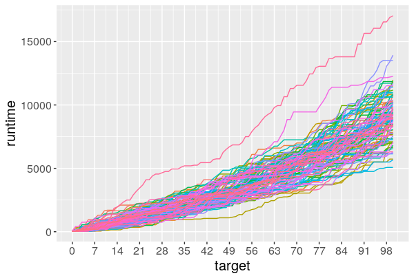
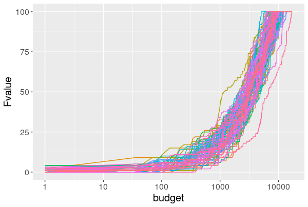

# IOHprofiler: Post-Processing

[This is](https://github.com/IOHprofiler/Post-Processing) the post-processing tool of the project __Iterative Optimization Heuristics Profiler__ (IOHprofiler). This tool provides a web-based interface to analyze and visualization the benchmark data, collected from previous experiments. Importantly, we __do support__ the widely used [COCO](https://github.com/numbbo/coco) data format (aka. Black-Box Optimization Benchmarking).

This tool is mainly built on R package [Shiny](https://shiny.rstudio.com/), [plotly](https://plot.ly/) and [Rcpp](http://www.rcpp.org/). To use this tool, two options are available:

1. local installation and execution (see [installation instructions](#install)) and
2. a [web-based service](#server) that you can use right away.

## <a name="install"></a>Installation

This software is mainly written in __R__. To run it directly from the source code, please install R environment first. The binary file and installation manual for R can be found here [https://cran.r-project.org/](https://cran.r-project.org/).

After R environment is correctly installed on you machine, several R packages are needed to execute the sorftware. Please start up the __R console__, which can be done (in case you're not familiar with R) by either executing command `R` in your system terminal or open the R application. Once it is done, please copy-paste and execute the following commands into the R console to install all depedencies.
  
```r
install.packages('shiny')
install.packages('shinyjs')
install.packages('shinydashboard')
install.packages('magrittr')
install.packages('dplyr')
install.packages('reshape2')
install.packages('data.table')
install.packages('markdown')
install.packages('Rcpp')
install.packages('plotly')
```

Note that it is important to check if aforementioned packages are correctly installed. The easiest method is to test if those packasges can be loaded:

```r
library(shiny)
library(shinyjs)
library(shinydashboard)
library(magrittr)
library(dplyr)
library(reshape2)
library(data.table)
library(markdown)
library(Rcpp)
library(plotly)
```

Error messages will be shown in your R console if there is any installation issue.

Then, please clone (or downlaod) this repository into your own system. To clone the repository, please execute the following command in your __system console__ (terminal):

```Shell
> git clone git@github.com:IOHprofiler/Post-Processing.git
```

```Shell
> git clone https://github.com/IOHprofiler/Post-Processing.git
```

To download, please click the green download button on this page.

To start the post-processing tool, please execute the following commands in the __R console__:

```r
> shiny::runApp('/path/to/the/clone/folder')
```

## <a name="server"></a> Online Service

Alternatively, we have built a server to put this tool online, which is currently hosted in [Leiden Institute of Advanced Computer Science](https://liacs.leidenuniv.nl/), Leiden University. The server can be accessed via [http://iohprofiler.liacs.nl:3838](http://iohprofiler.liacs.nl:3838).

## Documentation

The details on the experimentation and post-processing tool can be found on [www-ia.lip6.fr/~doerr/IOHprofiler-v1.pdf](www-ia.lip6.fr/~doerr/IOHprofiler-v1.pdf) or [arXiv.org](https://arxiv.org/abs/1810.05281).

## Data Preparation

Data preparation is fairly easy for this tool. Just compress the data folder obtained from the experiment into a __zip__ file and uploaded it. Currently, we support two data formats:

* IOHprofiler: our own csv-based format,
* COCO: data format of the [COCO benchmark environment](https://github.com/numbbo/coco).

## Programing Interface

In addition to the graphical user interface, it is possible to directly call several procedures to analyze the data.

* To read and align all the data set in a folder
  
```Shell
> ds <- read_dir('/path/to/data/folder')
> ds
DataSetList:
1: DataSet((1+1)-Cholesky-CMA on f1 2D)
2: DataSet((1+1)-Cholesky-CMA on f1 5D)
3: DataSet((1+1)-Cholesky-CMA on f1 10D)
4: DataSet((1+1)-Cholesky-CMA on f1 20D)
5: DataSet((1+1)-Cholesky-CMA on f10 2D)
6: DataSet((1+1)-Cholesky-CMA on f10 5D)
7: DataSet((1+1)-Cholesky-CMA on f10 10D)
8: DataSet((1+1)-Cholesky-CMA on f10 20D)
9: DataSet((1+1)-Cholesky-CMA on f11 2D)
10: DataSet((1+1)-Cholesky-CMA on f11 5D)
```

The return value is a list of __DataSets__. Each data set consists of:

  1. __runtime samples__ (aligned by target values),
  2. __function values samples__ (aligned by runtime) and
  3. __endogenous parameter samples__ of your optimization algorithm (aligned by target values).

* To get a general summary of one data set, you can use function `summary`:

```bash
> summary(ds[[1]])
DataSet Object: ((1+1)-Cholesky-CMA, f1, 2D)
80 instance are contained: 1,2,3,4,5,6,7,...,73,74,75,76,77,78,79,80

               target runtime.mean runtime.median runtime.sd succ_rate
   1:     70.10819126       1.0000            1.0  0.0000000    1.0000
   2:     66.42131777       1.0125            1.0  0.1118034    1.0000
   3:     62.98712083       1.1125            1.0  0.8999824    1.0000
   4:     62.54395893       1.1375            1.0  0.9242684    1.0000
   5:     61.73051944       1.2000            1.0  1.1295793    1.0000
  ---                                                                 
1478: 9.473524187e-10     182.6000          182.0 24.0894168    0.0625
1479: 2.759534823e-10     192.0000          188.5 13.5892114    0.0500
1480: 2.463309556e-10     195.6667          195.0 14.0118997    0.0375
1481: 5.223910193e-11     196.0000          196.0 19.7989899    0.0250
1482: 1.638511549e-11     210.0000          210.0         NA    0.0125

    budget  Fvalue.mean Fvalue.median    Fvalue.sd
 1:      1 1.672518e+01  1.171157e+01 1.626487e+01
 2:      2 1.341813e+01  7.960940e+00 1.466877e+01
 3:      3 1.100825e+01  6.439678e+00 1.261937e+01
 4:      4 9.326633e+00  5.492333e+00 1.213908e+01
 5:      5 7.501883e+00  2.946388e+00 1.204200e+01
---                                               
90:    229 4.902827e-09  4.506106e-09 2.863671e-09
91:    231 4.902827e-09  4.506106e-09 2.863671e-09
92:    238 4.902827e-09  4.506106e-09 2.863671e-09
93:    251 4.737548e-09  4.461953e-09 2.526087e-09
94:    257 4.737548e-09  4.461953e-09 2.526087e-09

Attributes: names, class, funcId, DIM, Precision, algId, comment, datafile, instance, maxEvals, finalFunvals
```

* To get a summary of one data set __at target values/budget values__ (e.g., the runtime distribution), you can use function `summarise_runtime` and `summarise_target`:
  
```bash
> summarise_runtime(ds[[1]], ftarget = 1e-1, maximization = FALSE)
             algId       f(x) runs  mean median       sd 2% 5% 10% 25% 50% 75% 90% 95% 98%
(1+1)-Cholesky-CMA 0.09986529   80 36.55   37.5 17.11236  4  5  14  22  37  49  57  67  68
```

```bash
> summarise_target(ds[[1]], runtimes = 100, maximization = FALSE)
             algId runtime runs           mean       median           sd           2%           5%          10%          25%          50%          75%          90%         95%         98%
(1+1)-Cholesky-CMA     100   80   0.0002333208 3.797025e-05 0.0004581431 9.843261e-08 4.168509e-07 8.343177e-07 6.090179e-06 3.797025e-05 0.0001831323 0.0006597004 0.001072814 0.001900295
```

```bash
> get_runtime_sample(ds[[1]], ftarget = 1e-1, maximization = F, format = 'long')
                algId          f(x) run RT
1  (1+1)-Cholesky-CMA 0.09986528573   1 69
2  (1+1)-Cholesky-CMA 0.09986528573   2 39
3  (1+1)-Cholesky-CMA 0.09986528573   3 38
4  (1+1)-Cholesky-CMA 0.09986528573   4 34
5  (1+1)-Cholesky-CMA 0.09986528573   5 67
6  (1+1)-Cholesky-CMA 0.09986528573   6  3
7  (1+1)-Cholesky-CMA 0.09986528573   7 36
8  (1+1)-Cholesky-CMA 0.09986528573   8 41
9  (1+1)-Cholesky-CMA 0.09986528573   9 14
10 (1+1)-Cholesky-CMA 0.09986528573  10 30
```

* It is also possible to generate some diagnostic plots (using `ggplot2`):

```bash
> ds <- read_dir('~/Dropbox/data/LO_adap_lambda/')
> plot(ds[[1]])
show data aligned by runtime?
```

<div class="row">
  <div class="column">
    
  </div>
  <div class="column">
    
  </div>
</div>

## :construction: TODO

The technical tasks to do are listed as follows:

* [ ] convert data processing code into a package
* [ ] add more stastistical tests
* [ ] implement the standard R `summary` method for `DataSet` and `DataSetList` classes
* [ ] add _ggplot2_ based static plotting procedures for the programming interface
* [ ] make the data analysis part as a separate R package
* [ ] to determine the data source to align the data set using runtimes

## Contact

If you have any questions, comments, suggestions or pull requests, please don't hesitate contacting us <IOHprofiler@liacs.leidenuniv.nl>!

## Cite us

The development team is:

* [Hao Wang](https://www.universiteitleiden.nl/en/staffmembers/hao-wang#tab-1), <i>Leiden Institute of Advanced Computer Science</i>,
* [Carola Doerr](http://www-desir.lip6.fr/~doerr/), <i>CNRS and Sorbonne University</i>, 
* [Furong Ye](https://www.universiteitleiden.nl/en/staffmembers/furong-ye#tab-1), <i>Leiden Institute of Advanced Computer Science</i>,
* [Sander van Rijn](https://www.universiteitleiden.nl/en/staffmembers/sander-van-rijn#tab-1), <i>Leiden Institute of Advanced Computer Science</i>,
* [Thomas Bäck](https://www.universiteitleiden.nl/en/staffmembers/thomas-back#tab-1), <i>Leiden Institute of Advanced Computer Science</i>.

When using IOHprofiler and parts thereof, please kindly cite this work as

Carola Doerr, Hao Wang, Furong Ye, Sander van Rijn, Thomas Bäck: <i>IOHprofiler: A Benchmarking and Profiling Tool for Iterative Optimization Heuristics</i>, arXiv e-prints:1810.05281, 2018.

```bibtex
@ARTICLE{IOHprofiler,
  author = {Carola Doerr and Hao Wang and Furong Ye and Sander van Rijn and Thomas B{\"a}ck},
  title = {{IOHprofiler: A Benchmarking and Profiling Tool for Iterative Optimization Heuristics}},
  journal = {arXiv e-prints:1810.05281},
  archivePrefix = "arXiv",
  eprint = {1810.05281},
  year = 2018,
  month = oct,
  keywords = {Computer Science - Neural and Evolutionary Computing},
  url = {https://arxiv.org/abs/1810.05281}
}
```
