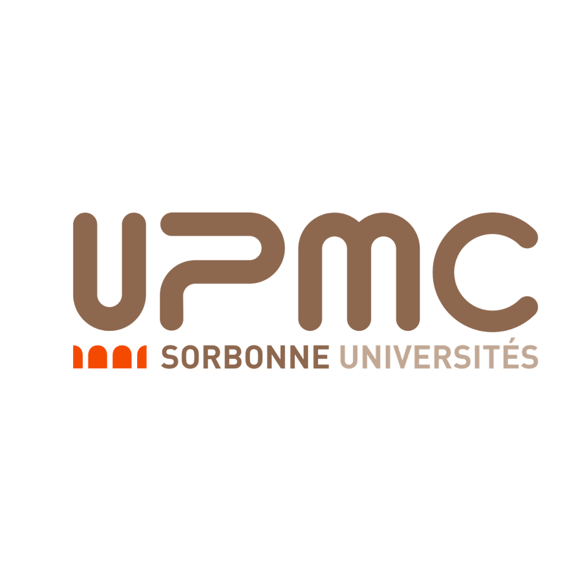

## License
This application is governed by the BSD-3 Clause license. 
You can use, modify and/or redistribute these codes under the terms of the BSD-3 Clause license.

## Development Team
* [Hao Wang](https://www.universiteitleiden.nl/en/staffmembers/hao-wang#tab-1), <i>Leiden Institute of Advanced Computer Science</i>, <h.wang@liacs.leidenuniv.nl>.

* [Carola Doerr](http://www-desir.lip6.fr/~doerr/), <i>Sorbonne University</i>, <Carola.Doerr@mpi-inf.mpg.de>.

* [Thomas Bäck](https://www.universiteitleiden.nl/en/staffmembers/thomas-back#tab-1), <i>Leiden Institute of Advanced Computer Science</i>, <t.h.w.baeck@liacs.leidenuniv.nl>.

