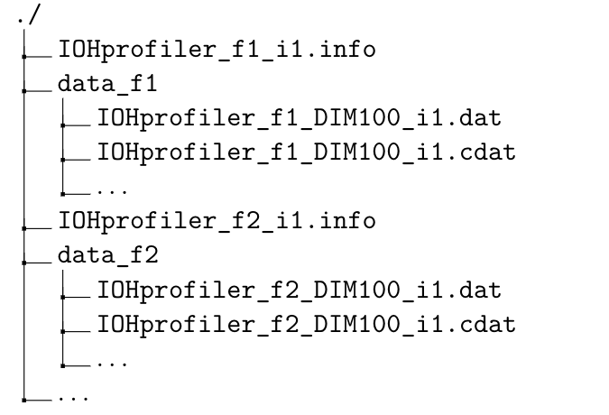

# Supported Data Format

The user is encouraged to analyze your own benchmark data using **IOHanalyzer**. For this purpose, users have prepare their own data set according to the supported data formats. At the time of writing, three data formats are supported by **IOHanalyzer**:

* **COCO** data format as regulated in [1].
* **IOHprofiler** data format, which is motivated and modified from **COCO**  data format.
* A **two-column** format that is simplified from **IOHprofiler** format.

When loading the data in programming interface (and in the graphical user interface as well), it is not necessary to specified which format the user took as **IOHanalyzer** detects the format automatically. For all three data formats, data files are organized in the same manner within the file system. The structure of data files exemplified as follows:



Generally, in the folder (e.g., `./` here) that contains the data set, the following files are mandatory for **IOHanalyzer**:

* _Meta-data_ (e.g., `IOHprofiler_f1_i1.info`) summarizes the algorithmic performance for each problem instance, with naming the following naming convention: `IOHprofiler_f[:num:]_i[:num:].info`  for problem $f1$ and instance $1$. Note that one meta-data file can consist of several dimensions. Please see the detail below.
* _Raw-data_ (e.g., `IOHprofiler_f1_DIM100_i1.dat`) are CSV-based files that contain performance information indexed by the running time. Raw-data files are named in the similar manner as with the meta-data, for example, `IOHprofiler_f1_DIM100_i1.dat` for problem $f1$, dimension $100$ and instance $1$. By default, the data files are organized in the group of test functions and stored in folders with naming convention: `data_[function ID]/`. It is important to note that those three data formats only differ in structure of the raw-data files.

## Meta-data

When benchmarking, it is common to specify a number of different dimensions, functions and instances, resulting in a quite large number of data files (e.g., `*.dat` files). It would make the data organization more structured if some meta data are provided. Here, the meta data are implemented in a format that is very similar to that in the well-known **COCO** environment. The meta data are indicated with suffix \verb|.info|. An small example is provided as follows:

```{bash}
suite = 'PBO', funcId = 10, DIM = 100, algId = '(1+1) fGA'
%
data_f10/IOHprofiler_f10_DIM625.dat, 1:1953125|5.59000e+02,
1:1953125|5.59000e+02, 1:1953125|5.59000e+02, 1:1953125|5.54000e+02,
1:1953125|5.59000e+02, 1:1953125|5.64000e+02, 1:1953125|5.54000e+02,
1:1953125|5.59000e+02, 1:1953125|5.49000e+02, 1:1953125|5.54000e+02,
1:1953125|5.49000e+02
suite = 'PBO', funcId = 10, DIM = 625, algId = '(1+1) fGA'
%
data_f10/IOHprofiler_f10_DIM625.dat, 1:1953125|5.59000e+02,
1:1953125|5.59000e+02, 1:1953125|5.59000e+02, 1:1953125|5.54000e+02,
1:1953125|5.59000e+02, 1:1953125|5.64000e+02, 1:1953125|5.54000e+02,
1:1953125|5.59000e+02, 1:1953125|5.49000e+02, 1:1953125|5.54000e+02,
1:1953125|5.49000e+02
...
```

Note that, as this meta information is also used in **IOHanalyzer** when loading the data, it is **crucial** to give an attention to the format of the meta data, if the user would convert their own data sets.

* **The first line** stores some meta-information of the experiment as (name, value) pairs. Note that, such pairs are separated by commas and three names, `funcId`, `DIM` and `algId` are _case-sensitive_ and _mandatory_.
* **The second line** always starts with a single `%`, indicating what follows this symbol should be the general comments from the user on this experiment. By default, it is left empty.
* **The third line** starts with the relative path to the actual data file, followed by the meta-information obtained on each instance, with the following format: $$\underbrace{1}_{\text{instance ID}}:\underbrace{1953125}_{\text{running time}}|\;\underbrace{5.59000e+02}_{\text{best-so-far f(x)}}$$

## Raw-data

Despite different events are used for those four types of data file, those files take the same format, which is adapted from CSV format to accommodate multiple runs/instances. Typically, this format is illustrated by the example below (with dummy data records):

```{bash}
"function evaluation"  "current f(x)" "best-so-far f(x)"  "current af(x)+b" "best af(x)+b" "parameter name"  ...
1  +2.95000e+02  +2.95000e+02  +2.95000e+02  +2.95000e+02  0.000000  ...
2  +2.96000e+02  +2.96000e+02  +2.96000e+02  +2.96000e+02  0.001600  ...
4  +3.07000e+02  +3.07000e+02  +3.07000e+02  +3.07000e+02  0.219200  ...
9  +3.11000e+02  +3.11000e+02  +3.11000e+02  +3.11000e+02  0.006400  ...
12  +3.12000e+02  +3.12000e+02  +3.12000e+02  +3.12000e+02  0.001600  ...
16  +3.16000e+02  +3.16000e+02  +3.16000e+02  +3.16000e+02  0.006400  ...
20  +3.17000e+02  +3.17000e+02  +3.17000e+02  +3.17000e+02  0.001600  ...
23  +3.28000e+02  +3.28000e+02  +3.28000e+02  +3.28000e+02  0.027200  ...
27  +3.39000e+02  +3.39000e+02  +3.39000e+02  +3.39000e+02  0.059200  ...
"function evaluation"  "current f(x)" "best-so-far f(x)"  "current af(x)+b" "best af(x)+b" "parameter name"  ...
1   +3.20000e+02  +3.20000e+02  +3.20000e+02  +3.20000e+02  1.000000  ...
24  +3.44000e+02  +3.44000e+02  +3.44000e+02  +3.44000e+02  2.000000  ...
60  +3.64000e+02  +3.64000e+02  +3.64000e+02  +3.64000e+02  3.000000  ...
"function evaluation"  "current f(x)" "best-so-far f(x)"  "current af(x)+b" "best af(x)+b" "parameter name"  ...
...  ... ... ... ...  ...  ...
```

Note that,

1. **[mandatory]** each _separation line_ (line that starts with `"function evaluation"`) serves as a separator among different independent runs of the same algorithm. Therefore, it is clear that the data block between two separation lines corresponds to a single run a triplet of (dimension, function, instance).
2. **[mandatory]** `"function evaluation"` the current number of function evaluations.
3. **[mandatory]** `"best-so-far f(x)"` keeps track of the best function value observed since the beginning of one run.
4. **[optional]** `"current f(x)"` stands for the function value observed when the corresponding number of function evaluation is consumed.
5. **[optional]** The value stored under `"current af(x)+b"` and `"best af(x)+b"`, are so-called _transformed_ function values, obtained on each function instances that are generated by translating the orginal function in its domain and co-domain.
6. **[optional]** In addition, a parameter value (named `"parameter"`) is also tracked in this example and recording more parameter value is also facilitated (see below).

## Two-Column Format

The raw data file, in its simplest **two-column** format should resemble the following example:

```{bash}
"function evaluation" "best-so-far f(x)"
1  +2.95000e+02
2  +2.96000e+02
4  +3.07000e+02  
23  +3.28000e+02
27  +3.39000e+02
"function evaluation" "best-so-far f(x)"  
1   +3.20000e+02
...  ...
```

This format is regulated as follows:

* The _double quotation_ (`"`) in the separation line shall always be kept and it cannot be replace with single quotation (`'`).
* The numbers in the record can either be written in the plain or scientific notation.
* To separate the column, _a single space or tab_ can be used (only one of them should be used consistently in a single data file).
* In the target-based tracking file (`*.dat`) each block of records (as divided by the separation line) **must** end with the last function evaluation.
* Each data line should contain a complete record. Incomplete data lines will be dropped when loading the data into **IOHanalyzer**.
* In case the quotation mark is needed in the parameter name, please use the single quotation (`'`).

## Reference

[1] Hansen N, Auger A, Finck S, Ros R (2009a). "Real-Parameter Black-Box OptimizationBenchmarking 2009: Experimental Setup." Research Report RR-6828, INRIA. URL <https://hal.inria.fr/inria-00362649.>
